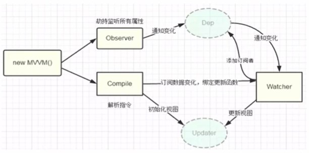

#### vue 的MVVM响应原理

几种实现双向绑定的做法:

> 发布者订阅者模式(backbone.js)
> 脏检查(angular.js)
> 数据劫持(vue.js)

**发布者-订阅者模式：** 一般通过sub，pub的方式实现数据和视图的绑定监听，更新数据方式通常做法人是`vm.set('property', value)`

而我们更希望通过`vm.property = value` 这种方式更新数据，同时自动更新视图，于是有了以下两种方式：

**脏检查:** angular.js是通过脏值检测的方式对比数据是否有变更，来决定是否更新视图，最简单的方式就是通过`setInterval()`，定时轮询检测数据变动，angular只有在指定的事件触发时进入脏值检测，大致如下：

- DOM事件(ng-click)
- XHR响应事件($http)
- 浏览器Location变更事件($location)
- Timer事件($timeout，$interval)
- 执行$digest()或$apply()

**数据劫持：** vue.js采用的是数据劫持结合发布者-订阅者模式的方式，用过`Object.defineProperty()`来劫持各个属性的`setter`，`getter`，在数据变动时发布消息给订阅者，触发响应的监听回调

实现一个指令解析器Compile
实现一个数据监听器Observer
实现一个观察者Watcher
实现一个代理Proxy