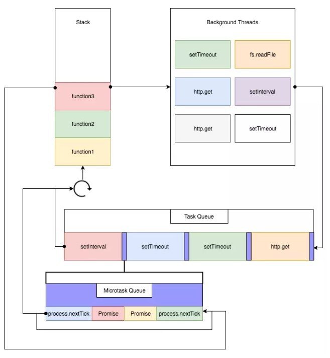

#### Event Loop

Event Loop是计算机的一种运行机制，JavaScript语言就采用这种机制，来解决单线程运行的一些问题。

因此，这里只介绍浏览器中Event Loop和NodeJs中的Event Loop的运行机制。

运行以后的程序叫做**进程**，一般情况下一个进程一次只能执行一个任务，如果需要执行更多任务，不外乎三种解决方案：

1. 排队。等前面任务执行完后，再执行后面的任务；
2. 新建进程。为每一个任务建一个进程。
3. 新建线程。新建进程过于耗费资源，因此程序往往允许一个进程包含多个线程，由线程去完成任务。

JavaScript语言是一种单线程语言，所有任务都在一个线程上完成，因此采用上述第一种方法来执行程序任务。
这样就会产生问题，一旦遇到大量任务或一个耗时的任务（比如大量I/O操作），就会出现堵塞情况，无法响应用户的行为。
Event Loop就是为了解决这种问题而提出的。

- 浏览器的Event Loop是在html5的规范中明确定义。
- NodeJS的Event Loop是基于libuv实现的。
- libuv已经对Event Loop做出了实现，而html5规范中的只是定义了浏览器中Event Loop的模型，具体的实现留给了浏览器厂商。

##### 宏队列和微队列

**宏队列，macrotask，也称tasks**，属于tasks的异步任务包括：

- setTimeout
- setInterval
- setImmediate（Node独有）
- requestAnimationFrame（浏览器独有）
- I/O
- UI rendering（浏览器独有）

**微队列，microtask，也称jobs**，属于jobs的异步任务包括：

- process.nextTick（Node独有）
- Promise
- Object.observe
- MutationObserve

##### 浏览器的Event Loop



JavaScript代码具体执行的流程：

1. 执行全局JavaScript代码，同步代码立即执行，异步代码分类存入macrotask，microtask；
2. 全局JavaScript代码执行完毕，调用栈Stack会清空；
3. 从microtask中取出队首任务，放入调用栈Stack中执行，执行完后microtask长度减1，以此类推，直至microtask中的所有任务都执行完毕。**注意：如果在执行microtask的过程中，又产生了microtask，会加入到队列末尾，也会在本次周期中调用执行**；
4. microtask中的所有任务都执行完毕，此时microtask为空队列，调用栈Stack也为空；
5. 取出宏队列macrotask中位于队首的任务，放入Stack中执行，同步代码立即执行，异步代码分类存入macrotask，microtask；
6. 执行完毕后，调用栈Stack为空；
7. 重复第3-7个步骤；

重点：

1. macrotask一次只从队列中取一个任务执行，执行完后就去执行microtask中的任务；
2. microtask中所有的任务都会被依次取出来执行，直到microtask为空；
3. UI rendering是由浏览器自行判断决定的，时机是在执行完所有的microtask之后，下一个macrotask之前，紧跟着执行UI render的；

#### NodeJs的Event Loop

##### NodeJs中宏队列回调的6个阶段

- timers阶段：这个阶段执行setTimeout和setInterval预定的callback
- I/O callback阶段：执行除了close事件的callbacks、被timers设定的callbacks、setImmediate()设定的callbacks这些之外的callbacks
- idle, prepare阶段：仅node内部使用
- poll阶段：获取新的I/O事件，适当的条件下node将阻塞在这里
- check阶段：执行setImmediate()设定的callbacks
- close callbacks阶段：执行socket.on('close', ....)这些callbacks


```
   ┌───────────────────────┐
┌─>│        timers         │<————— 执行 setTimeout()、setInterval() 的回调
│  └──────────┬────────────┘
|             |<-- 执行所有 Next Tick Queue 以及 MicroTask Queue 的回调
│  ┌──────────┴────────────┐
│  │     pending callbacks │<————— 执行由上一个 Tick 延迟下来的 I/O 回调（待完善，可忽略）
│  └──────────┬────────────┘
|             |<-- 执行所有 Next Tick Queue 以及 MicroTask Queue 的回调
│  ┌──────────┴────────────┐
│  │     idle, prepare     │<————— 内部调用（可忽略）
│  └──────────┬────────────┘     
|             |<-- 执行所有 Next Tick Queue 以及 MicroTask Queue 的回调
|             |                   ┌───────────────┐
│  ┌──────────┴────────────┐      │   incoming:   │ - (执行几乎所有的回调，除了 close callbacks 以及 timers 调度的回调和 setImmediate() 调度的回调，在恰当的时机将会阻塞在此阶段)
│  │         poll          │<─────┤  connections, │ 
│  └──────────┬────────────┘      │   data, etc.  │ 
│             |                   |               | 
|             |                   └───────────────┘
|             |<-- 执行所有 Next Tick Queue 以及 MicroTask Queue 的回调
|  ┌──────────┴────────────┐      
│  │        check          │<————— setImmediate() 的回调将会在这个阶段执行
│  └──────────┬────────────┘
|             |<-- 执行所有 Next Tick Queue 以及 MicroTask Queue 的回调
│  ┌──────────┴────────────┐
└──┤    close callbacks    │<————— socket.on('close', ...)
   └───────────────────────┘
```

**NodeJS中宏队列主要有4个：**

1. Timers Queue
2. IO Callbacks Queue
3. Check Queue
4. Close Callbacks Queue

**NodeJS中微队列主要有2个**：

1. Next Tick Queue：是放置process.nextTick(callback)的回调任务的
2. Other Micro Queue：放置其他microtask，比如Promise等

**NodeJs的Event Loop执行过程：**

1. 执行全局Script的同步代码，将异步任务分类；
2. 执行microtask微任务，先执行所有Next Tick Queue中的所有任务，再执行Other Microtask Queue中的所有任务；
3. 开始执行macrotask宏任务，共6个阶段，从第1个阶段开始执行相应每一个阶段macrotask中的所有任务，**注意，这里是所有每个阶段宏任务队列的所有任务，浏览器的Event Loop中是只取宏队列的第一个任务出来执行**，每一个阶段的macrotask任务执行完毕后，开始执行微任务，也就是步骤2
4. Timers Queue -> 步骤2 -> I/O Queue -> 步骤2 -> Check Queue -> 步骤2 -> Close Callback Queue -> 步骤2 -> Timers Queue ......

**注意：在NodeJs11 版本以后Event Loop进行了修改，更靠近浏览器机制，在每个阶段宏任务队列的任务取出位于队首的任务，执行完毕后，执行微任务队列，然后继续执行此阶段宏任务对列中的任务，依次类推；**

- [带你彻底弄懂Event Loop](https://segmentfault.com/a/1190000016278115)
- [nodejs中的event loop](https://www.jianshu.com/p/deedcbf68880)


